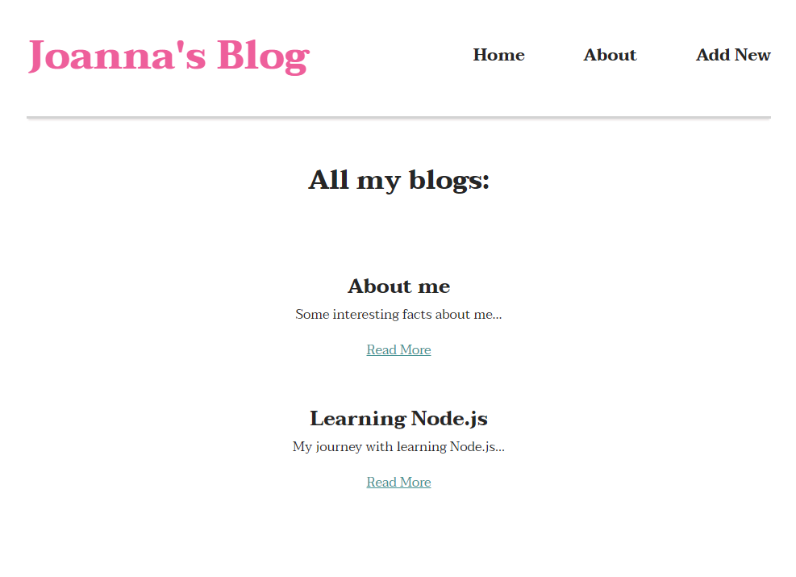
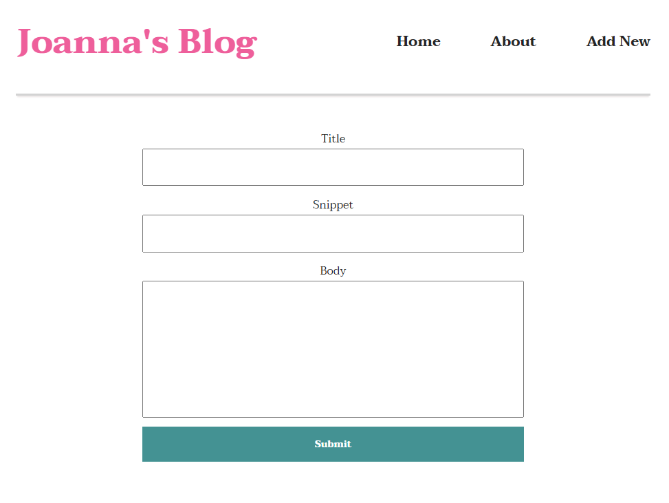
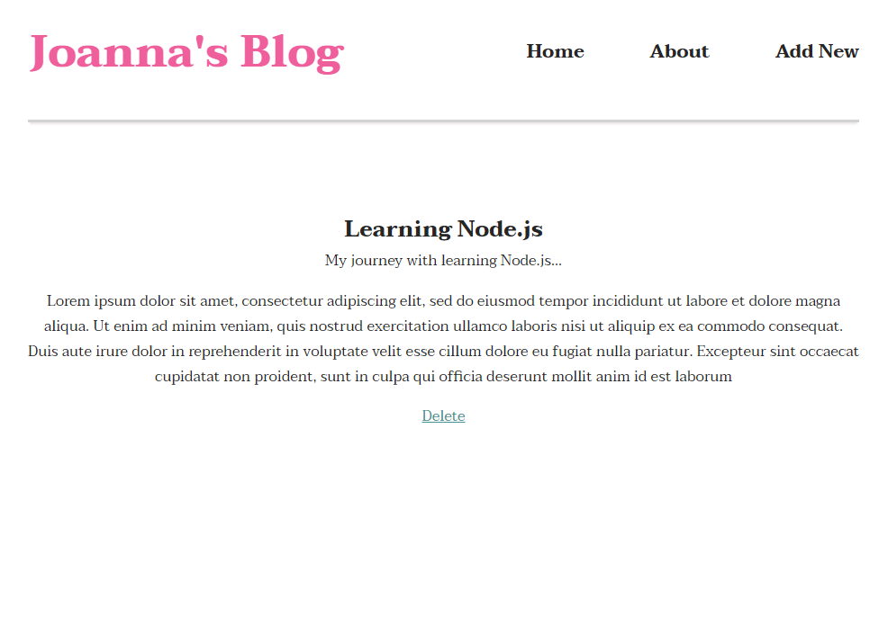

# Joanna's Basic Blog

## A personal mini blog project created to learn Node.js. It gets, posts, and deletes selected blog entries. Technologies used:

* Express
* Nodemon
* Lodash
* EJS
* Morgan
* mongoDB
* Mongoose
* vanilla CSS

